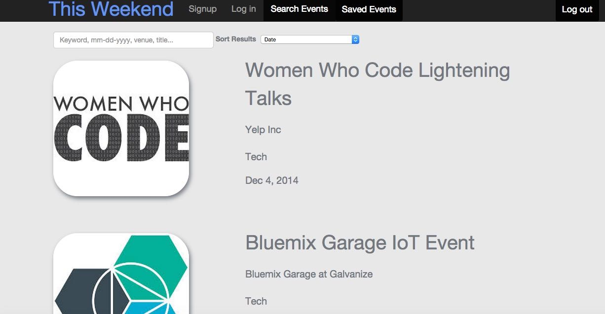
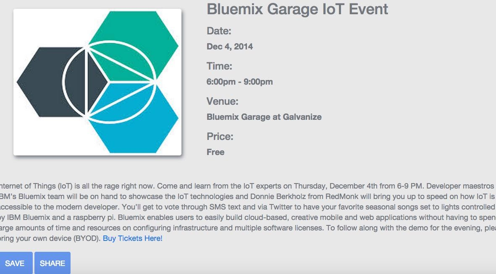
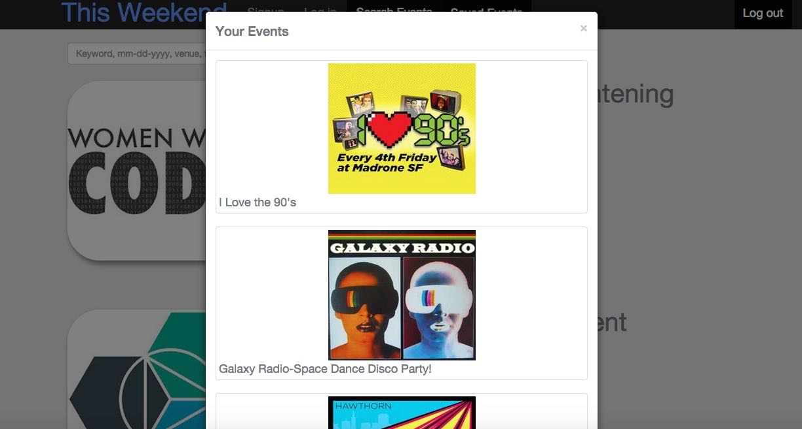

Readme
======

Overview
========

This Weekend is a San Francisco event search application using data from Eventbrite and an AngularJS framework with a focus on providing both performance and accuracy. It was inspired by Eventbrite's goal to produce a user friendly, household product where users can easily find an event to attend this weekend or any day of the week. 

Features
========

<h4>Users can: </h4>
<ul>
<li>Log-in/logout and sign-in to their account</li>
<li>Query a list of events with keywords, dates, venues etc.</li>
<li>Order their results by date or alphabet</li>
<li>Select events to see their details</li>
<li>Save events to view later</li>
<li>Share events with other users</li>
</ul>

Event List and Search
=====================

Users can easily search for events in San Francisco and filter their results with keywords, venue name, title, or date. They can also use an option selector to either order their results by date or alphabetically. This Weekend uses Angular’s ng-repeat directive to repeat each event in the view with uniform styling provided by custom CSS and Bootstrap. Results are filtered using a ‘query’ filter and an ‘order by’ filter. 

The query filter allows users to quickly filter the list of events displayed in the view. The view is then instantly updated with a filtered list of events related to their query thanks to the use of AngularJS and it's two-way binding of the model to the view. The user can then order their results by date or alphabetically with the order selector. Once the user sees an event they are interested in they can click the title, which then changes the view to display an event details page.  

 

Event Detail View
=================

The event detail view gives more information about each event and contains two additional features, Save Event and Share Event. 

If the user decides to save an event, the current event is added to a list contained in a database so that each user's events can be viewed once they have logged in. 

When a user decides to share an event, a modal appears in the view that prompts them to enter a username of the user they wish to share with. Once that username is entered, the event is added to that user's list of saved events. 

 

Saved Events
============

Below is the display of saved events that can be accessed by selecting the Saved Events option in the navigation bar. 

Once a user clicks that option a Bootstrap modal is displayed with a list of their events, which was created with the AngularJS ng-repeat directive and custom CSS styling.

 

Technologies and Stack
======================

<h4>Front-end</h4>

AngularJS framework, CSS, HTML, Twitter Bootstrap

<h4>Back-end</h4>

Python, SQLALchemy, Sqlite, Flask, Eventbrite API

### Installation

Install dependencies using pip:

    $ pip install -r requirements.txt

While you wait, obtain credentials for the Eventbrite API:

    * [App key](http://eventbrite.com/api/key)
    * [User key](http://eventbrite.com/userkeyapi)

### Running server

    $ app_key=<YOUR_EVENTBRITE_APP_KEY> \
      user_key=<YOUR_EVENTBRITE_USER_KEY> \
      python server.py

